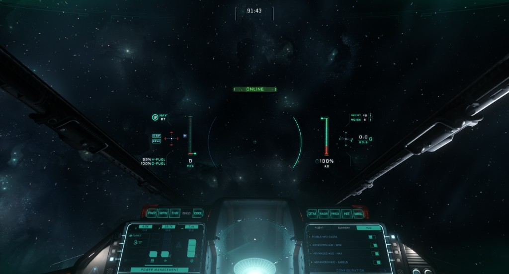

# 2. Learning the HUD

**[Video: HUD and controls](https://youtu.be/DAkuSrkm1Y8)**

You need to know what you're looking at before you can act on it. The HUD tells you where you're going, where to aim, and whether you can still evade. If you don't know where your vector or delta is, you're flying blind. Most players start in basic mode — we'll set up **Advanced HUD** and remove the hologram so you get the info that matters in combat.

---

## Setup: Advanced HUD and hologram off

Do this on the ship **MFD** (Multi-Function Display). Open the **Configuration** panel, **HUD** tab. Enable **Advanced HUD** (SCM and NAV — so you see it in both modes). Turn **Advanced HUD - Hologram** off. That removes the cockpit hologram and keeps the display clean. Ideally you'd set these as defaults in game options — we cover that later.

---

## What you're looking at

Key elements on the Advanced HUD:

- **Mode** — SCM vs NAV. You need to see which you're in so you don't hit NAV by accident in a fight or forget to switch when you run.
- **Speed** — your current speed (left bar); stay under the **speed wall** (max SCM without boost) in a fight so lateral acceleration stays strong.
- **TVI (trajectory / velocity indicator)** — the marker showing your **vector** (direction of travel). In decoupled, nose and TVI can point different ways; you need the TVI always visible.
- **Pip** — predicted impact point when you have a target. Where to aim so shots hit; also shows closing / same vector / extending. Lead pips on, always visible when targeted.
- **Delta** — when target locked: difference in velocity between you and them. Positive = closing, negative = separating. Use it on the merge.
- **G-meter** — how many G's you're pulling. Useful to feel when you're at the limit; G-Safe off so the ship isn't capping you.
- **Boost bar** — when it's empty you can't evade or run. Fatigue gets you killed; save boost for the fight.

---

**Checkpoint:** You can set up Advanced HUD and hologram off on the MFD, and you can name TVI, pip, delta, speed wall, and boost bar and say why each matters in combat.
