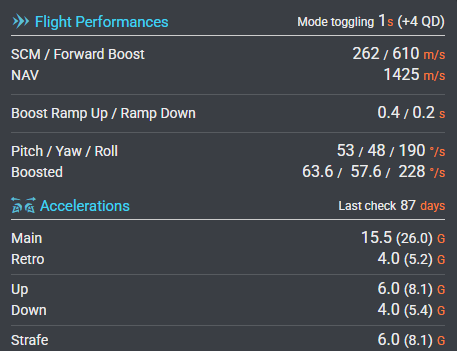

# 3. Basic controls

**[Video: HUD and controls](https://youtu.be/DAkuSrkm1Y8)** — covers this lesson and the previous one.

Understanding how to control your ship could mean the difference between life and death. Control your ship better than your opponent and you will have a better win rate in fights. This section is designed to teach you the basics of space manoeuvrability and how to control your ship.

---

## Space is different

In space your ship can move in any direction and turn on any axis. That's **six degrees of freedom** (6DOF) — the X, Y, and Z axes. Three for *where you go* (movement), three for *which way your nose points* (rotation).

**Where you go:** forward/back (throttle/retro), up/down (vertical strafe), left/right (horizontal strafe).  

**Which way your nose points:** up/down (pitch), left/right (yaw), rotation (roll).

The key: **nose and travel can be different.** You can slide left while facing forward, drift backward while pitching up, or orbit a target with your nose locked on it. Once you feel that separation, everything else makes sense.

---

## Mouse and keyboard vs sticks

**M+K** (mouse and keyboard), **HOTAS** (hands on throttle and stick), or **HOSAS** (two sticks) — any of them work. Sticks give better immersion and fine control for many pilots, but plenty of top pilots fly M+K. **Pedals** are optional; they add another layer of control and can give you an edge in a fight. Use what you have. The principles in this guide apply to all of them.

We cover *which* controls you need to bind — throttle, strafe, pitch, yaw, roll, boost, brake. How you bind them is up to you. Keybinds are personal.

---

## Movement — where you go

- **Throttle** — forward (like a gas pedal). **Retro** — thrust the opposite way for braking or going backward.  
- **Strafe** — left, right, up, down. You slide without the nose turning. In combat, strafe is how you get evasive and adjust position.

---

## Turning — which way the nose points

- **Pitch** — nose up or down (like nodding "yes").  
- **Yaw** — nose left or right (like shaking your head "no").  
- **Roll** — the ship twists; nose stays roughly where it is, wings and roof spin.  

On most ships, **roll is fastest, then pitch, then yaw.** Turning to face a target above you? Roll so they're in front, then pitch. Faster than yawing across. You'll use that in orbits and every duel.

---

## SCM and NAV

Your ship has two speed modes. **SCM** (Space Combat Maneuvers) is your combat speed — lower ceiling, tighter handling. **NAV** (Navigation) is for travel — higher speed, less maneuverable. You fight in SCM; you use NAV to get somewhere. Switching between them takes a second or so — you can't flip instantly. Each ship has different SCM and NAV limits. Tools like SPViewer show the exact numbers for any hull.

*Example: SCM ~260 m/s, NAV ~1400 m/s for this ship. Boost pushes you higher in SCM. The numbers vary by ship.*

---

## Boost and brake

- **Boost** — afterburner. Use it in short bursts for strafe — to get evasive or correct position — not to go faster forward in a fight. Empty boost bar means you can't evade or run.  
- **Space brake** — one input to stop (cancel your velocity). Often X by default. Brake and boost should be separate bindings so you don't waste boost when slowing down — we cover that later.

---

## Practice

Arena Commander or Free Flight. Name every axis. Feel the difference between strafing and turning. That separation is the foundation.

---

**Checkpoint:** You know nose and travel can differ, you can name throttle, strafe, pitch, yaw, roll, boost, and brake, you know roll > pitch > yaw for speed, and you know SCM is for combat and NAV is for travel.
