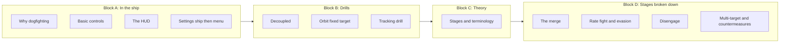

# Dogfighting path restructure — fun-first, beginner-focused

## Goal

Restructure the **Dogfighting** learning path so that:

1. **It does not start with settings** — settings come after the learner is already in a ship, using controls and reading the HUD.
2. **It targets new players** — flown once or twice, maybe basic combat or none; terminology is introduced as we go.
3. **Flow:** In-ship basics (controls, HUD) → simple settings from ship → main menu settings → **drills** (movement, decoupled, tracking) → **theory** (stages, terminology) → **stages broken down** (merge, rate fight, disengage, etc.).

---

## Proposed path structure (four blocks)

---

## Block A: In the ship (fun first)

**Audience:** You've flown a bit; maybe shot at something. We get you into a ship and make the HUD and controls mean something before touching settings.

| Lesson ID | Title                | Purpose                                                                                                                                                                                                                                        | Terminology to introduce                            |
| --------- | -------------------- | ---------------------------------------------------------------------------------------------------------------------------------------------------------------------------------------------------------------------------------------------- | --------------------------------------------------- |
| df-1      | Why dogfighting      | Short, fun hook: PvP ship combat, AC vs PU, what we're building toward. No jargon dump.                                                                                                                                                        | PvP, Arena Commander (AC), Persistent Universe (PU) |
| df-2      | Basic controls       | Throttle, strafe (forward/back, left/right, up/down), pitch/yaw/roll, boost, space brake. "What your hands do."                                                                                                                                | Strafe, pitch, yaw, roll, boost, brake              |
| df-3      | Learning the HUD     | What you look at in the cockpit: speed, mode (SCM/NAV), TVI (direction you're moving), pip (when you have a target), G-meter, boost bar.                                                                                                       | HUD, TVI, pip, SCM, NAV, G-meter                    |
| df-4      | Settings that matter | **From the ship / before you leave:** minimal "so you're not fighting the game." **Then main menu:** decoupled default, G-Safe off, TVI always on, space brake ≠ boost, etc. Frame as "now that you've seen the HUD, here's why these matter." | Decoupled, G-Safe (brief)                           |

**Lesson copy:** Short, clear, with checkpoints. Our own wording; no dependency on external videos.

---

## Block B: Drills

**Purpose:** Build muscle memory for movement before theory. All in Arena Commander (or Free Flight); fixed targets first.

| Lesson ID | Title                       | Purpose                                                                                                               | Terminology                             |
| --------- | --------------------------- | --------------------------------------------------------------------------------------------------------------------- | --------------------------------------- |
| df-5      | Decoupled and the brake     | What decoupled means (keep momentum), space brake (X) to stop. Why it matters for combat.                             | Decoupled, coupled, space brake, vector |
| df-6      | Drill: Orbit a fixed target | Fly around a station or pillar with nose on it; decoupled orbit. (e.g. in Free Flight or AC, pick a fixed structure.) | Orbit, nose on target                   |
| df-7      | Drill: Tracking             | Keep crosshair on a fixed point while moving (e.g. pass by, circle). Prep for keeping pip on a moving target.         | Tracking                                |

Optional later or folded in: simple circle-strafe or corkscrew drill (passive evasion) once they can orbit.

---

## Block C: Theory

**Purpose:** One (or two) lessons that give the big picture and the words we'll use in "stages broken down."

| Lesson ID | Title                           | Purpose                                                                                                                                                                                                                                                                                                           | Terminology                     |
| --------- | ------------------------------- | ----------------------------------------------------------------------------------------------------------------------------------------------------------------------------------------------------------------------------------------------------------------------------------------------------------------- | ------------------------------- |
| df-8      | Stages of a fight and key terms | Every fight has a merge, a duel (rate fight), and sometimes a disengage. **This lesson must explain what every key term means** — see "Terms we explain" below. Glossary-style but readable; new players should finish knowing vector, delta, rate, pips, etc. **Clarify:** rate fight ≠ knife fight (see below). | All terms in the glossary below |

Theory only — no drill. Our own glossary and stage breakdown.

**Terminology: rate fight vs knife fight (must distinguish in df-8 and df-10)**

- **Rate fight** = the *turning duel*: both ships orbiting each other, matching turn rates, pips in pitch, nose on nose. It's the *type* of engagement (the "binary circle"). Can happen at effective weapon range (e.g. 500–800 m); it's not defined by distance.
- **Knife fight** = *very close range* (e.g. inside 450 m with slow weapons, or just "tight in") or a *style* where you dodge by closing in rather than creating distance. So: knife fight = range or style; rate fight = the orbit duel.
- In lesson copy: define both and say explicitly that the rate fight is the orbit duel; "knife fight" is when that duel (or any fight) is at very close range, or when a pilot prefers staying tight. Avoid using the two terms interchangeably.

**Terms we explain (df-8 theory lesson + in-context in earlier lessons)**

Every term below must be **defined in plain language** where it's first needed; df-8 should gather them into one place so new players can refer back. Suggested definitions (tune in lesson copy):

| Term               | One-line definition                                                                                                                                         | Where introduced                |
| ------------------ | ----------------------------------------------------------------------------------------------------------------------------------------------------------- | ------------------------------- |
| **Vector**         | The direction (and sense) your ship is moving through space; independent of where the nose points.                                                          | df-5 (decoupled) or df-3 (HUD)  |
| **TVI**            | Trajectory / velocity indicator — the HUD marker showing your current direction of travel (your vector).                                                    | df-3 (Learning the HUD)         |
| **Delta**          | The difference in velocity between you and your target (closing or separating). Shown on HUD when target locked; positive = closing, negative = separating. | df-3 (HUD) or df-8 (theory)     |
| **Pip**            | Predicted impact point — the marker showing where to aim so your shots hit a moving target; also shows relative motion (closing / same vector / extending). | df-3 (HUD), then df-8           |
| **Pip neutralise** | Strafing so your vector matches the target's (pip over their ship); lets you close or hold position. Strafing opposite the pip = extending.                 | df-8, then df-10                |
| **Rate**           | Turn rate — how fast you can put your nose on target. Pitch rate is usually better than yaw; "rate fight" = duel where both are matching turn rates.        | df-8                            |
| **Rate fight**     | The turning duel: both ships orbiting, matching turn rates, pips in pitch, nose on nose ("binary circle"). Not the same as knife fight.                     | df-8, df-10                     |
| **Merge**          | Closing into effective weapon range so the fight can begin; the moment you're in range and committed.                                                       | df-8, then df-9                 |
| **Nose authority** | Who has their nose on target first in the duel; that pilot can lead the other around.                                                                       | df-8, df-10                     |
| **Speed wall**     | Max speed in SCM without boost (ship-specific); above it your lateral acceleration drops. Stay under it in a fight.                                         | df-8 or df-10                   |
| **SCM / NAV**      | SCM = Space Combat Maneuvers (weapons, shields, limited speed). NAV = Navigation (fast, no weapons/shields).                                              | df-3 (HUD)                      |
| **Disengage**      | Breaking off the fight (turn away, build distance, go to NAV, boost out).                                                                                   | df-8, df-11                     |
| **Knife fight**    | Very close range, or a style where you dodge by closing in rather than creating distance. Distinct from "rate fight."                                       | df-8 (contrast with rate fight) |

---

## Block D: Stages broken down

**Purpose:** One lesson per stage (plus optional multi-target/countermeasures). Deep enough to practice in AC.

| Lesson ID | Title                            | Purpose                                                                                                                                                                                                                                                 |
| --------- | -------------------------------- | ------------------------------------------------------------------------------------------------------------------------------------------------------------------------------------------------------------------------------------------------------- |
| df-9      | The merge                        | Closing rate ~200 m/s, NAV merge (brake ~3 km), delta merge (they're coming at you). Common mistakes (overshoot, no boost, wrong mode).                                                                                                                |
| df-10     | The turning duel and evasion     | The **rate fight** (turning duel: both orbiting, nose on nose). Pip in pitch, nose authority, boost in strafe, cone of death, staying off their nose. Knife fight = when this happens at very close range. |
| df-11     | Disengage                        | When to run (low boost, low hull, outnumbered), how (turn away, NAV, boost out).                                                                                                                                                                        |
| df-12     | Multi-target and countermeasures | 2v1, 2v2, target priority; flares/chaff, missiles as pressure not crutch. Optional: ship choice, weapons (or link to Learning to fly / SPViewer).                                                                                                       |

---

## Data and UI changes

**File:** [basicTraining.ts](../apps/landing/src/data/basicTraining.ts)

- **Replace** the current `dogfighting` category `lessons` array (df-1 … df-8) with the **new 12 lessons** (df-1 … df-12) in the order above.
- **Update** `DOGFIGHTING_IDS` to the new ordered list (df-1 through df-12).
- **Update** `RECOMMENDED_LESSON_ORDER`: remove old df-* and add the new df-1 … df-12 in order (after flying, before fps).
- **Learning path** and **badge** stay (path id `dogfighting`, badge `dogfighter`); they already key off the category's lessons.
- **Graduate** badge: already depends on total lesson count and recommended order; updating the list is enough.

**File:** [BasicTraining.tsx](../apps/landing/src/components/BasicTraining.tsx)

- No structural change. Path selector and lesson list already iterate over `LEARNING_PATHS` and category lessons. If we want **block headers** in the left nav (e.g. "In the ship", "Drills", "Theory", "Stages"), we'd add optional `sections` to the dogfighting path (like professions). Plan assumes **flat list** first; sections can be a follow-up.

**Optional:** Add `sections` to the dogfighting path so the left nav shows Block A / B / C / D. That requires defining `PathSection[]` with `lessonIds` per block and passing `path.sections` into the existing sectioned nav in BasicTraining (same pattern as professions).

---

## Checklist before implementation

- Confirm 12 lessons (df-1 … df-12) and four-block structure.
- Decide: flat list vs `sections` (Block A/B/C/D) in left nav.
- Write or adapt lesson `text` for each new lesson (terminology, checkpoints, one resource or video per lesson where useful). **df-8 must include the full glossary** (vector, delta, rate, pips, pip neutralise, rate fight, merge, nose authority, speed wall, SCM/NAV, disengage, knife fight) so new players can refer back.
- Add `videoUrl` or `resources[]` only if we create or license our own content later; this guide is text-first and comprehensive.
- Update `DOGFIGHTING_IDS`, `RECOMMENDED_LESSON_ORDER`, and category `lessons` in basicTraining.ts.
- Smoke-test: path selector, progress, badge, graduate badge.

---

## Out of scope (this plan)

- New routes or pages.
- Changing "Learning to fly" path (it stays as-is; dogfighting can assume it's done or not, per product choice).
- External video or third-party content; this is our own complete training guide. Video or resources can be added later if we create or license content.
